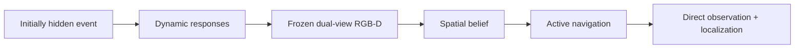
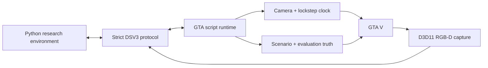

# DroneSimInGTAV

DroneSimInGTAV is a GTA V research platform for localizing initially hidden
urban events from event-induced dynamic responses. A scripted aerial camera
must observe responders such as approaching fire trucks and fleeing
pedestrians, maintain a spatial hypothesis, navigate, directly observe the
event, and report its location.

This repository is not an oracle ObjectNav environment, a video capture tool,
or a drone-dynamics simulator. Its focus is controlled event-response
experiments, synchronized RGB-D, fixed-step interaction, privileged evaluation
truth, and reproducible expert-data generation.



The current controlled experiment uses a burning vehicle, fire trucks moving
toward it, and pedestrians activated in an outward response wave. The broader
research goal is a counterfactual benchmark covering multiple event and
response types. See [Research direction](docs/research_direction.md).

## Platform capabilities

- same-frame RGB and metric depth captured from GTA's D3D11 renderer;
- named `oblique` (`-45°`) and `nadir` (`-90°`) RGB-D views at one frozen
  simulation instant;
- a lockstep clock in which every non-terminal research action advances
  exactly `250 ms` of GTA simulation time;
- scripted-camera lifecycle, collision-checked pose control, time, weather,
  and player-area loading;
- a controlled fire scenario with immutable blueprints, staged responders,
  stable entity IDs, and structured evaluation truth;
- geometry-based occlusion and visibility queries isolated from the agent;
- reusable per-anchor source-shadow start pools, followed by per-scene
  projected and real-RGB-D-certified start catalogs;
- a cue-grounded expert that builds a belief from RGB-D responder tracks and
  produces replayable trajectories;
- online stability, geometry, timing, visibility, and scenario validators.

## Research task at a glance

| Component | Definition |
|---|---|
| Observation | Synchronized oblique/nadir RGB-D and start-local odometry |
| Hidden from agent | Event coordinates, GTA handles, world camera matrices, entity truth, and visibility truth |
| Actions | `FORWARD`, `ASCEND`, `DESCEND`, `TURN_LEFT`, `TURN_RIGHT`, `HOLD`, `STOP` |
| Motion | `1 m` translation or `15°` yaw; actions cannot be combined |
| Time | Every action except `STOP` advances `250 ms`; inference wall time is frozen |
| Default horizon | 80 actions including `STOP` |
| Success | Issue `STOP`, directly observe the fire-source vehicle, and estimate its start-local 3D position within `5 m` |

The event is hidden in the initial observation. A valid dynamic cue requires
the same active responder in two adjacent observations, at least `0.4 m` of
horizontal displacement, and event-relative direction cosine of at least
`0.5`. Full visibility, coordinate, action, and timing semantics are specified
in [Task specification](docs/task_specification.md).

## Current status

| Component | Status |
|---|---|
| Camera, synchronized metric RGB-D | Stable online validation |
| Lockstep time and dual-view observation | Stable online validation |
| Controlled fire-response scenario and truth | Implemented |
| Occlusion-aware starts and visibility evaluation | Implemented |
| Cue-grounded expert and dataset generation | Implemented |
| Incremental and Spatial RNN learned 2-D belief updaters | Offline baselines implemented |
| Spatial RNN online belief/planner loop and replay | Implemented; GTA acceptance run required |
| Explicit-belief learned seven-action policy | Implemented; offline and GTA acceptance runs required |
| Response-ecology statistical benchmark | Planned |
| Paired counterfactual interventions | Planned |
| Additional event types | Planned |
| Learned RGB-D perception, action policy, and Awareness | Not yet implemented |

The expert is a data-generation baseline, not the final learned model. GTA AI
trajectories are not frame-identical across reconstructed runs; blueprints,
scenario structure, action timing, and evaluation interfaces are the
reproducible units. Dataset retention additionally requires a valid dynamic
cue and a counterfactual cue-sensitivity check; those are expert-quality
filters rather than extra `TaskSuccess` conditions.

## Quick start

### 1. Build and install the plugin

Requirements:

- GTA V Legacy with ScriptHookV;
- Visual Studio 2026 with **Desktop development with C++**;
- Windows SDK, v145 toolset, and x64 Release configuration;
- Python with the dependencies listed in `agent_control/requirements.txt`.

Open `DroneSim.sln`, build `Release | x64`, and copy `DroneSim.asi` next to
`GTA5.exe`. The repository does not install or copy the ASI automatically.

Install Python dependencies:

```powershell
python -m pip install -r agent_control\requirements.txt
```

Start GTA V, load Story Mode, and press `F10` to create the scripted camera.
The plugin listens on `127.0.0.5:23456`. Press `F11` for emergency cleanup and
return to the player. Manual inspection controls are `W/A/S/D`, `Z/C` for
vertical motion, `Q/E` for yaw, and `F9` for the current world pose. While the
manual camera is active, `F8` appends its current XYZ position to
`<GTA V>\data\DroneSim_anchors.jsonl` for later multi-location collection.

### 2. Check the RGB-D runtime

The standard stability test performs 1,000 in-memory captures and writes no
image or depth payload:

```powershell
python validation\validate_rgbd_stability.py --count 1000
```

For a shorter first check use `--count 20`. The complete validation matrix is
in [Validation guide](docs/validation.md).

### 3. Run and inspect one expert episode

Fly the scripted camera over a suitable road and omit `--anchor`, or provide a
repeatable GTA world coordinate explicitly:

```powershell
python validation\validate_stage2e_expert.py `
  --anchor 234 324 100 `
  --record-dir recordings\stage2e_demo
```

Replay the compact diagnostic trajectory without connecting to GTA:

```powershell
python validation\visualize_stage2e_trajectory.py `
  recordings\stage2e_demo
```

Without `--record-dir`, validation remains entirely in memory. Compact
validation recordings contain JPEG RGB and structured diagnostics, never
metric depth.

### 4. Generate a dataset batch

Only successful episodes retain their RGB-D payloads. Online depth remains
`float32`; the dataset writer stores metre-valued `float16` depth to reduce
disk use without cropping or downsampling:

First fly the manual camera to each desired location and press `F8` once. Then
collect, for example, one scene and five successful starts per saved anchor:

```powershell
python validation\generate_stage2e_experts.py `
  --anchor-file "C:\path\to\Grand Theft Auto V\data\DroneSim_anchors.jsonl" `
  --scenes-per-anchor 1 `
  --starts-per-scene 5 `
  --max-attempts-per-scenario 15 `
  --output-dir dataset\stage2e_multi_anchor
```

Before creating a fresh grouped dataset, the generator audits every anchor once
with a source-only static scene (`0` responders) and builds its source-shadow
`start_pool.json`. The current deterministic pool samples 42--60 m radius in
2 m increments, 25--60 m AGL, and dense azimuths inside ray-supported building
shadows, then keeps at most 160 spatially distributed entries. Smoke-envelope
visibility is recorded only as a diagnostic;
start eligibility depends on occlusion of the fire-source vehicle. Anchors with
too few static positions are removed from an `--anchor-file` atomically. An
`UNKNOWN` protocol/load failure aborts without changing the file. No backup is
created, so keep the source list elsewhere if it is valuable.

For each requested scene slot, the generator then tries deterministic
seed-distinct blueprints. `starts_per_scene` is the hard acceptance quota. The
generator tries to certify up to `starts_per_scene + scene_catalog_reserve`
starts through projected response visibility and a real dual-view RGB-D
grounder check, but a reserve shortfall does not reject an otherwise usable
scene. This catalog is
built once, persisted in the schema-4 manifest, and every entry is attempted at
most once. `--max-scene-seed-candidates` bounds scene replacement; protocol or
capture errors stop collection instead of being misclassified as bad seeds.
The expert treats a response-derived belief mode as a directional waypoint,
executes one collision-checked strict-action chunk, then observes again; reaching
the belief centroid is not treated as reaching the hidden event.

`--scenario-count` and `--episodes-per-scenario` remain supported aliases for
`--scenes-per-anchor` and `--starts-per-scene`. Each anchor gets its own
seed-distinct immutable scenario blueprints and each scene has an independent
success quota and attempt budget; a scene that exhausts its budget is not filled
from another location. A single coordinate can still be supplied with
`--anchor X Y Z`. Startup prints a conservative payload/free-space estimate.
Resume an interrupted collection with the exact same arguments plus `--resume`;
completed episodes, schema-4 manifest, pool and scene-catalog digests, event position, static
occlusion masks, and blueprint signature are verified before appending. Schema
1/2/3 collections remain viewable but cannot be resumed by this generator.

Validate one anchor's source-shadow pool online without saving payloads:

```powershell
python validation\validate_anchor_start_pool.py `
  --anchor 234 324 100 --verify-seed-isolation
```

Play every retained episode in order:

```powershell
python validation\visualize_stage2e_dataset.py `
  dataset\stage2e_multi_anchor --loop
```

The player does not connect to GTA and does not load metric depth. `Space`
pauses, `Left/Right` steps, `Home/End` jumps within an episode, `Up/Down`
changes episode, and `Q` closes the window. Batch timing can be summarized
without creating another artifact:

```powershell
python validation\summarize_stage2e_timings.py dataset\stage2e_multi_anchor
```

Dataset schema and recording behavior are documented in
[Dataset format](docs/dataset_format.md).

### 5. Train the learned belief baselines

Stage 3A provides two offline structured-track baselines: an explicit additive
incremental updater and a belief-only Spatial ConvGRU. Both infer a `61 x 61`
start-local posterior before the fire source is directly grounded. Teacher
beliefs are diagnostics only; the event cell supervises every source-blind
inference step with an episode-normalized NLL.

Train both models with the same anchor-disjoint split and supervision window:

```powershell
python -m pip install -r learning\requirements.txt

python learning\train_belief_updater.py `
  dataset\stage2e_multi_anchor `
  --supervision inference `
  --output learning\checkpoints\stage3_incremental_inference.pt

python learning\train_spatial_belief.py `
  dataset\stage2e_multi_anchor `
  --output learning\checkpoints\stage3_spatial_rnn.pt
```

Evaluate the Spatial RNN and print one common table for the uniform prior,
incremental updater, and Spatial RNN:

```powershell
python learning\evaluate_spatial_belief.py `
  dataset\stage2e_multi_anchor `
  learning\checkpoints\stage3_spatial_rnn.pt

python learning\compare_belief_models.py `
  dataset\stage2e_multi_anchor `
  learning\checkpoints\stage3_incremental_inference.pt `
  learning\checkpoints\stage3_spatial_rnn.pt
```

Run the Spatial RNN contract, invariance, D4, backward, overfit, checkpoint,
and five-epoch full-data smoke checks with:

```powershell
python validation\validate_spatial_belief.py dataset\stage2e_multi_anchor
```

Validate the exact streaming feature and recurrent-step contracts of a trained
checkpoint without connecting to GTA:

```powershell
python validation\validate_online_spatial_belief_offline.py `
  dataset\stage2e_5x20_v4 `
  --checkpoint learning\checkpoints\stage3_spatial_rnn.pt `
  --devices auto
```

The Spatial RNN never receives `FIRE_SOURCE` tracks or pose tensors. Its only
cross-time state is the normalized one-channel log-belief map; padding, missing
motion evidence, and the source-visible phase are exact identity updates. It is
still an entity-token, planar baseline.

### 6. Run the Spatial RNN online

The online entry point supports `shadow` (Stage 2 expert controls while the RNN
is observed) and `control` (the RNN belief drives the shared fixed planner).
In control mode, diffuse posteriors cannot trigger `FOLLOW_BELIEF`: entropy must
be at most `6.5` and the 80% credible region at most `8000 m2`. Until then the
agent performs finite cue scans, motion confirmation, altitude transition, or
`HOLD`; the gate and its reason are stored in the trajectory diagnostics.
The held-out `anchor_002` used by the current checkpoint is:

```powershell
python validation\validate_online_spatial_belief.py `
  --anchor 129.64151 -9.242669 80.02359 `
  --checkpoint learning\checkpoints\stage3_spatial_rnn.pt `
  --mode control --episodes 1 --max-steps 65 --device cuda `
  --record-dir recordings\stage3_online_001
```

Without `--record-dir`, the run writes no image or belief payload. A recording
contains only two JPEG streams, `trajectory.json`, and the exact online
`61 x 61` beliefs; it never stores Depth. Replay it offline with the same
four-panel layout as Stage 2E:

```powershell
python validation\visualize_online_spatial_belief.py `
  recordings\stage3_online_001 --start-paused
```

The lower-left heatmap is loaded from the runtime `beliefs.npz`; it is not a
teacher belief and is not recomputed by the player. Event truth is displayed
only as an evaluation overlay. Stage 3B changes no ASI code.

### 7. Train and run the explicit-belief action policy

Stage 3C replaces the fixed confidence state machine and A* with a learned
seven-action policy while retaining an explicit causal bottleneck:

```text
grounded response tracks -> Spatial RNN belief -> learned policy -> strict action
dual-view Depth ---------> local geometry ------^
```

Response tracks can enter the policy only through the normalized `61 x 61`
belief. The policy additionally receives current Depth-derived local geometry,
odometry, the last four executed actions, and a separate directly grounded
fire-source token. It cannot read response tracks, evidence maps, recurrent
gates, teacher belief, event truth, A*, or GTA geometry action masks.

Train behavior cloning from a schema-4 dataset and an existing Spatial RNN:

```powershell
python learning\train_explicit_belief_policy.py `
  dataset\stage2e_5x5_0824 `
  --belief-checkpoint learning\checkpoints\stage3_spatial_rnn_5x5_0824.pt `
  --output learning\checkpoints\stage3c_explicit_belief_policy_bc.pt `
  --device cuda
```

Run the strict offline model, streaming, and compact-DAgger contracts, then
evaluate the held-out anchors:

```powershell
python validation\validate_explicit_belief_policy.py `
  dataset\stage2e_5x5_0824 `
  learning\checkpoints\stage3c_explicit_belief_policy_bc.pt --device cuda

python validation\validate_online_belief_policy_offline.py `
  dataset\stage2e_5x5_0824 `
  learning\checkpoints\stage3c_explicit_belief_policy_bc.pt --device cuda

python validation\validate_stage3c_dagger.py `
  dataset\stage2e_5x5_0824 `
  learning\checkpoints\stage3c_explicit_belief_policy_bc.pt --device cuda

python learning\evaluate_explicit_belief_policy.py `
  dataset\stage2e_5x5_0824 `
  learning\checkpoints\stage3c_explicit_belief_policy_bc.pt --split validation `
  --ablations normal uniform teacher no-depth rotate
```

Run one planner-free GTA episode and optionally record the same four-panel
diagnostic layout. Without `--record-dir`, no image or belief payload is saved:

```powershell
python validation\validate_online_belief_policy.py `
  --anchor 228.825653 -610.282898 51.108658 `
  --checkpoint learning\checkpoints\stage3c_explicit_belief_policy_bc.pt `
  --mode control --episodes 1 --max-steps 80 --device cuda `
  --start-pool dataset\stage2e_5x5_0824\anchor_004\start_pool.json `
  --record-dir recordings\stage3c_online_001

python validation\visualize_online_belief_policy.py `
  recordings\stage3c_online_001 --start-paused
```

Collect DAgger only on the checkpoint's recorded training anchors. The three
rounds default to expert execution probabilities `0.50`, `0.25`, and `0.00`:

```powershell
python validation\collect_stage3c_dagger.py `
  dataset\stage2e_5x5_0824 `
  --checkpoint learning\checkpoints\stage3c_explicit_belief_policy_bc.pt `
  --round 1 --output-dir dataset\stage3c_dagger_round_01 --device cuda

python learning\train_explicit_belief_policy.py `
  dataset\stage2e_5x5_0824 `
  --belief-checkpoint learning\checkpoints\stage3_spatial_rnn_5x5_0824.pt `
  --policy-initialization learning\checkpoints\stage3c_explicit_belief_policy_bc.pt `
  --dagger-root dataset\stage3c_dagger_round_01 --dagger-iteration 1 `
  --output learning\checkpoints\stage3c_explicit_belief_policy_dagger_01.pt `
  --device cuda
```

DAgger shards contain structured features and compressed `uint8` local
geometry only. They do not contain RGB, Depth, point clouds, or teacher belief;
rows without an expert label are retained but excluded from action loss. Since
the remaining expert path is undefined after learner deviations, all DAgger
rows are also excluded from the auxiliary remaining-action value loss. The
collector validates and reuses each schema-4 anchor's recorded static start
pool instead of rebuilding it for every episode.

The method, inputs, exclusions, losses, and current 2-D limitation are defined
in [Belief learning baseline](docs/belief_learning.md).

## Architecture



The network thread never calls GTA natives. It submits typed commands to the
GTA script thread and returns only after execution. RGB and depth are copied
from one render cycle, while conversion and transport run off the capture
boundary. Agent observations are stripped of world matrices and scenario
truth; privileged interfaces are reserved for generation and evaluation.

See [Architecture](docs/architecture.md) and
[Controlled scenarios](docs/scenarios.md) for the full lifecycle, thread,
protocol, seed, and truth boundaries.

## Repository layout

```text
DroneSim/        C++ ASI runtime, capture, clock, protocol, and scenarios
agent_control/   strict Python client, task actions, expert, and recording
learning/        structured-track belief model, training, and evaluation
validation/      online validators and offline trajectory visualizers
docs/            task, architecture, scenario, dataset, and validation docs
```

## Reproducibility and storage

- inference and RGB-D transfer wall time do not advance controlled actors;
- scenario seeds control the immutable blueprint, not frame-exact GTA AI
  navigation;
- one GTA instance must be driven by one Python client;
- validators write no visual payload unless an explicit recording/output path
  is supplied;
- `dataset/` and `recordings/` are ignored by Git;
- evaluation truth must never be inserted into the agent observation.

## Limitations

- only the controlled fire event is currently implemented;
- responders use explicitly issued GTA navigation tasks;
- particle rendering is diagnostic appearance, not geometric truth;
- native response ecology and counterfactual conditions have not yet been
  statistically validated;
- learned belief and action selection remain structured-observation baselines;
  raw RGB-D perception, vertical belief, and causal Awareness are not included;
- current data contain too few vertical actions to claim reliable 3-D control;
- GTA V, ScriptHookV, and game assets are not distributed by this repository.

## Documentation

- [Task specification](docs/task_specification.md)
- [Architecture](docs/architecture.md)
- [Controlled scenarios](docs/scenarios.md)
- [Dataset format](docs/dataset_format.md)
- [Belief learning baseline](docs/belief_learning.md)
- [Validation guide](docs/validation.md)
- [Research direction](docs/research_direction.md)

## Citation and license

A citation will be added with the first public benchmark release. This
repository does not currently declare a software license; do not assume rights
beyond those explicitly granted by the repository owner. GTA V, ScriptHookV,
and all third-party dependencies retain their respective licenses.
