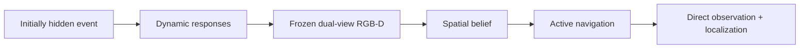
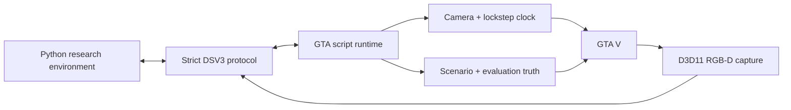

# DroneSimInGTAV

DroneSimInGTAV is a GTA V research platform for localizing initially hidden
urban events from event-induced dynamic responses. A scripted aerial camera
must observe responders such as approaching fire trucks and fleeing
pedestrians, maintain a spatial hypothesis, navigate, directly observe the
event, and report its location.

This repository is not an oracle ObjectNav environment, a video capture tool,
or a drone-dynamics simulator. Its focus is controlled event-response
experiments, synchronized RGB-D, fixed-step interaction, privileged evaluation
truth, and reproducible expert-data generation.



The current controlled experiment uses a burning vehicle, fire trucks moving
toward it, and pedestrians activated in an outward response wave. The broader
research goal is a counterfactual benchmark covering multiple event and
response types. See [Research direction](docs/research_direction.md).

## Platform capabilities

- same-frame RGB and metric depth captured from GTA's D3D11 renderer;
- named `oblique` (`-45°`) and `nadir` (`-90°`) RGB-D views at one frozen
  simulation instant;
- a lockstep clock in which every non-terminal research action advances
  exactly `250 ms` of GTA simulation time;
- scripted-camera lifecycle, collision-checked pose control, time, weather,
  and player-area loading;
- a controlled fire scenario with immutable blueprints, staged responders,
  stable entity IDs, and structured evaluation truth;
- geometry-based occlusion and visibility queries isolated from the agent;
- a cue-grounded expert that builds a belief from RGB-D responder tracks and
  produces replayable trajectories;
- online stability, geometry, timing, visibility, and scenario validators.

## Research task at a glance

| Component | Definition |
|---|---|
| Observation | Synchronized oblique/nadir RGB-D and start-local odometry |
| Hidden from agent | Event coordinates, GTA handles, world camera matrices, entity truth, and visibility truth |
| Actions | `FORWARD`, `ASCEND`, `DESCEND`, `TURN_LEFT`, `TURN_RIGHT`, `HOLD`, `STOP` |
| Motion | `2 m` translation or `15°` yaw; actions cannot be combined |
| Time | Every action except `STOP` advances `250 ms`; inference wall time is frozen |
| Default horizon | 65 actions including `STOP` |
| Success | Issue `STOP`, directly observe the fire-source vehicle, and estimate its start-local 3D position within `5 m` |

The event is hidden in the initial observation. A valid dynamic cue requires
the same active responder in two adjacent observations, at least `0.4 m` of
horizontal displacement, and event-relative direction cosine of at least
`0.5`. Full visibility, coordinate, action, and timing semantics are specified
in [Task specification](docs/task_specification.md).

## Current status

| Component | Status |
|---|---|
| Camera, synchronized metric RGB-D | Stable online validation |
| Lockstep time and dual-view observation | Stable online validation |
| Controlled fire-response scenario and truth | Implemented |
| Occlusion-aware starts and visibility evaluation | Implemented |
| Cue-grounded expert and dataset generation | Implemented |
| Response-ecology statistical benchmark | Planned |
| Paired counterfactual interventions | Planned |
| Additional event types | Planned |
| Learned belief policy and Awareness supervision | Not yet implemented |

The expert is a data-generation baseline, not the final learned model. GTA AI
trajectories are not frame-identical across reconstructed runs; blueprints,
scenario structure, action timing, and evaluation interfaces are the
reproducible units. Dataset retention additionally requires a valid dynamic
cue and a counterfactual cue-sensitivity check; those are expert-quality
filters rather than extra `TaskSuccess` conditions.

## Quick start

### 1. Build and install the plugin

Requirements:

- GTA V Legacy with ScriptHookV;
- Visual Studio 2026 with **Desktop development with C++**;
- Windows SDK, v145 toolset, and x64 Release configuration;
- Python with the dependencies listed in `agent_control/requirements.txt`.

Open `DroneSim.sln`, build `Release | x64`, and copy `DroneSim.asi` next to
`GTA5.exe`. The repository does not install or copy the ASI automatically.

Install Python dependencies:

```powershell
python -m pip install -r agent_control\requirements.txt
```

Start GTA V, load Story Mode, and press `F10` to create the scripted camera.
The plugin listens on `127.0.0.5:23456`. Press `F11` for emergency cleanup and
return to the player. Manual inspection controls are `W/A/S/D`, `Z/C` for
vertical motion, `Q/E` for yaw, and `F9` for the current world pose. While the
manual camera is active, `F8` appends its current XYZ position to
`<GTA V>\data\DroneSim_anchors.jsonl` for later multi-location collection.

### 2. Check the RGB-D runtime

The standard stability test performs 1,000 in-memory captures and writes no
image or depth payload:

```powershell
python validation\validate_rgbd_stability.py --count 1000
```

For a shorter first check use `--count 20`. The complete validation matrix is
in [Validation guide](docs/validation.md).

### 3. Run and inspect one expert episode

Fly the scripted camera over a suitable road and omit `--anchor`, or provide a
repeatable GTA world coordinate explicitly:

```powershell
python validation\validate_stage2e_expert.py `
  --anchor 234 324 100 `
  --record-dir recordings\stage2e_demo
```

Replay the compact diagnostic trajectory without connecting to GTA:

```powershell
python validation\visualize_stage2e_trajectory.py `
  recordings\stage2e_demo
```

Without `--record-dir`, validation remains entirely in memory. Compact
validation recordings contain JPEG RGB and structured diagnostics, never
metric depth.

### 4. Generate a dataset batch

Only successful episodes retain their RGB-D payloads. Online depth remains
`float32`; the dataset writer stores metre-valued `float16` depth to reduce
disk use without cropping or downsampling:

First fly the manual camera to each desired location and press `F8` once. Then
collect, for example, one scene and five successful starts per saved anchor:

```powershell
python validation\generate_stage2e_experts.py `
  --anchor-file "C:\path\to\Grand Theft Auto V\data\DroneSim_anchors.jsonl" `
  --scenes-per-anchor 1 `
  --starts-per-scene 5 `
  --max-attempts-per-scenario 15 `
  --output-dir dataset\stage2e_multi_anchor
```

`--scenario-count` and `--episodes-per-scenario` remain supported aliases for
`--scenes-per-anchor` and `--starts-per-scene`. Each anchor gets its own
seed-distinct immutable scenario blueprints and each scene has an independent
success quota and attempt budget; a scene that exhausts its budget is not filled
from another location. A single coordinate can still be supplied with
`--anchor X Y Z`. Startup prints a conservative payload/free-space estimate.
Resume an interrupted collection with the exact same arguments plus `--resume`;
completed episodes and the blueprint signature are verified before appending.

Play every retained episode in order:

```powershell
python validation\visualize_stage2e_dataset.py `
  dataset\stage2e_multi_anchor --loop
```

The player does not connect to GTA and does not load metric depth. `Space`
pauses, `Left/Right` steps, `Home/End` jumps within an episode, `Up/Down`
changes episode, and `Q` closes the window. Batch timing can be summarized
without creating another artifact:

```powershell
python validation\summarize_stage2e_timings.py dataset\stage2e_multi_anchor
```

Dataset schema and recording behavior are documented in
[Dataset format](docs/dataset_format.md).

## Architecture



The network thread never calls GTA natives. It submits typed commands to the
GTA script thread and returns only after execution. RGB and depth are copied
from one render cycle, while conversion and transport run off the capture
boundary. Agent observations are stripped of world matrices and scenario
truth; privileged interfaces are reserved for generation and evaluation.

See [Architecture](docs/architecture.md) and
[Controlled scenarios](docs/scenarios.md) for the full lifecycle, thread,
protocol, seed, and truth boundaries.

## Repository layout

```text
DroneSim/        C++ ASI runtime, capture, clock, protocol, and scenarios
agent_control/   strict Python client, task actions, expert, and recording
validation/      online validators and offline trajectory visualizers
docs/            task, architecture, scenario, dataset, and validation docs
```

## Reproducibility and storage

- inference and RGB-D transfer wall time do not advance controlled actors;
- scenario seeds control the immutable blueprint, not frame-exact GTA AI
  navigation;
- one GTA instance must be driven by one Python client;
- validators write no visual payload unless an explicit recording/output path
  is supplied;
- `dataset/` and `recordings/` are ignored by Git;
- evaluation truth must never be inserted into the agent observation.

## Limitations

- only the controlled fire event is currently implemented;
- responders use explicitly issued GTA navigation tasks;
- particle rendering is diagnostic appearance, not geometric truth;
- native response ecology and counterfactual conditions have not yet been
  statistically validated;
- no learned policy or causal Awareness bottleneck is included yet;
- GTA V, ScriptHookV, and game assets are not distributed by this repository.

## Documentation

- [Task specification](docs/task_specification.md)
- [Architecture](docs/architecture.md)
- [Controlled scenarios](docs/scenarios.md)
- [Dataset format](docs/dataset_format.md)
- [Validation guide](docs/validation.md)
- [Research direction](docs/research_direction.md)

## Citation and license

A citation will be added with the first public benchmark release. This
repository does not currently declare a software license; do not assume rights
beyond those explicitly granted by the repository owner. GTA V, ScriptHookV,
and all third-party dependencies retain their respective licenses.
