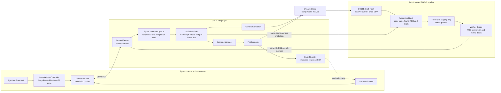

# DroneSimInGTAV

DroneSimInGTAV is a small GTA V research runtime for controlling a scripted
camera, acquiring synchronized RGB-D observations, and running a minimal
controlled fire-response experiment. Stage 1 adds structured event/entity
truth without restoring the old oracle recorder or training pipeline.

The research direction is hidden-event localization from event-induced dynamic
responses. See [docs/research_direction.md](docs/research_direction.md).

## Architecture



The network thread never calls GTA natives directly. It validates each request,
places a typed command in the queue, and waits for the GTA script thread to
return a correlated result. Scenario preparation and maintenance advance from
the per-frame runtime tick. RGB-D capture remains a separate render-thread
pipeline, so scenario logic cannot manufacture or cache observations.

`RelativePoseController` and Capture V3 form the agent-facing boundary.
Scenario snapshots contain privileged event and entity truth for experiment
control and evaluation; they must not be included in an agent observation.

## Repository layout

```text
DroneSim/                  GTA V ASI plugin
  camera.*                 camera lifecycle and absolute pose control
  command_queue.*          request-correlated GTA-thread commands
  rgbd_capture.*           synchronized Capture V3 implementation
  scenario_manager.*       single-scenario lifecycle coordinator
  fire_scenario.*          asynchronous controlled fire experiment
  entity_registry.*        stable entity IDs and response truth
  script.*                 minimal GTA script runtime
  server.*                 DSV3 TCP protocol server
agent_control/
  dronesim_client.py       strict Python client and relative-pose wrapper
  requirements.txt         online validation dependencies
validation/
  validate_pose_control.py
  validate_rgbd_pointcloud.py
  validate_rgbd_stability.py
  validate_rgbd_yaw_sync.py
  validate_fire_scenario.py
```

## Build and install

Requirements:

- GTA V Legacy with ScriptHookV
- Visual Studio 2026 with Desktop development with C++
- Windows SDK and the v145 toolset
- x64 Release configuration

Open `DroneSim.sln`, select `Release | x64`, and build. Copy the resulting
`DroneSim.asi` next to `GTA5.exe`. The repository does not automatically copy
or install the ASI.

The plugin listens on `127.0.0.5:23456` by default.

- F9 shows the current GTA world position and camera rotation in the
  bottom-left notification feed.
- F10 creates the scripted camera.
- F11 stops the scripted camera and restores the player after validation teleportation.
- W/S move forward/backward by 1 metre.
- A/D strafe left/right by 1 metre.
- Q/E turn left/right by 15 degrees.
- Z/C move up/down by 1 metre.

Manual translation uses the same collision check as the network pose API.
Each physical key press performs one step; holding a key does not repeatedly
move the camera. While the scripted camera is active, GTA gameplay controls
are suppressed so these keys do not also move or operate the player. Pause
menu controls remain available, and normal player input resumes after F11.

The same camera operations are available through the Python client.

## Python client

Install only the validation dependencies:

```powershell
python -m pip install -r agent_control\requirements.txt
```

Basic use:

```python
from agent_control.dronesim_client import (
    DroneSimClient,
    RelativePoseController,
)

client = DroneSimClient()
client.create_camera()

pose = client.get_pose()
frame = client.capture()

# The plugin receives an absolute GTA world position and yaw. Pitch and roll
# remain unchanged.
actual = client.set_camera_pose(
    pose[0],
    pose[1],
    pose[2],
    pose[5] + 45.0,
    collision_check=False,
)

# Agent-facing wrapper: forward, right, vertical, yaw delta.
controller = RelativePoseController(client, collision_check=True)
controller.synchronize()
controller.step_relative(0.5, 0.0, 0.0, 10.0)
```

All non-capture commands acknowledge only after the GTA script thread has
executed them. The Python client contains no settling sleeps. A failed command
raises `DroneSimCommandError` with one of:

- `CAMERA_INACTIVE`
- `INVALID_POSE`
- `COLLISION_BLOCKED`
- `COMMAND_TIMEOUT`
- `POSE_APPLY_FAILED`
- `POSE_MISMATCH`
- `INVALID_REQUEST`
- `INTERNAL_ERROR`

Capture keeps the existing V3 response: request/frame IDs, RGB, metric depth,
FOV, clip planes, projection matrix, and world-to-view matrix.

## Controlled fire scenario

The experiment lifecycle is `PREPARING -> READY -> RUNNING`, followed by an
explicit Reset. Prepare snaps the requested anchor to a nearby road, resolves
a deterministic blueprint, loads models, clears the controlled area, and
places a damaged `blista`, `firetruk` actors, and civilian pedestrians. Start
records one GTA timer/frame origin, activates the fire, and issues each
response task exactly once.

The Python client exposes:

```python
scenario_id = client.prepare_fire_scenario(
    anchor_world_xyz=(x, y, z),
    seed=1,
    firetruck_count=1,
    pedestrian_count=32,
)
ready = client.wait_scenario_ready(scenario_id)
start = client.start_scenario(scenario_id)
snapshot = client.get_scenario_state(scenario_id)
client.reset_scenario(scenario_id)
```

The caller must first teleport the player to the event area so GTA has loaded
collision there. Scenario truth is intended for experiment control and
evaluation; it is not exposed by `RelativePoseController`.

## Online validation

Every validation consumes RGB-D in memory. No image, depth map, video, PLY,
PCD, or point cloud is written to disk.

```powershell
python validation\validate_camera_lifecycle.py
python validation\validate_pose_control.py
python validation\validate_rgbd_yaw_sync.py
python validation\validate_rgbd_pointcloud.py --pixel-stride 4 --max-view-depth 200
python validation\validate_rgbd_stability.py --count 1000
python validation\validate_fire_scenario.py --anchor X Y Z
python validation\validate_fire_scenario.py --anchor X Y Z --cycles 50
python validation\validate_fire_scenario.py --anchor X Y Z --rgbd-captures 1000
python validation\validate_fire_scenario.py --anchor X Y Z --require-clean-area
```

Mission entities inside the controlled radius are never deleted. They are
preserved and reported separately in `snapshot.protected_entities`; the normal
validator prints a warning and continues. Formal clean-area collection should
use `--require-clean-area`. While a scenario is active, all ambient and
scenario-ped density multipliers are set to zero each frame. Existing ordinary
entities that cross into the 120-metre controlled area are removed by periodic
area maintenance; protected mission entities remain registered.

When the scripted camera is active, the fire-scenario validator moves it once,
after Prepare reaches READY, directly above the resolved event position. This
avoids a second visible relocation while the scene is starting. The default
observer view is 40 metres above the event at a -70 degree pitch. Use
`--camera-height` and `--camera-pitch` to adjust the overview;
`--camera-pitch -90` looks straight down. Pitch control is a validation utility
and does not change the agent-facing relative-pose action.

To validate collision rejection, choose a world coordinate beyond a nearby
wall or inside solid geometry. A simpler option is to place the camera in front
of a wall, face the wall, and test a point ten metres forward:

```powershell
python validation\validate_pose_control.py --expect-forward-collision 10
```

The explicit world-coordinate form remains available as
`--expect-collision X Y Z`.

The lifecycle test stops and recreates the camera, verifies the inactive error,
and captures immediately without sleeps. `validate_pose_control.py` alternates
two absolute positions and yaws, then checks that the returned pose and Capture
V3 view matrix agree. The yaw synchronization test distinguishes RGB and depth
from two views. The point-cloud test merges eight directions into an
interactive in-memory cloud. The stability test checks 1,000 captures,
monotonic frame IDs, finite metric depth, latency, and GTA process memory.

## Protocol boundary

The transport remains DSV3. Retained commands are:

- create/stop/query camera
- get pose and set absolute position plus yaw
- set FOV, time, and weather
- teleport/protect and restore the player
- synchronized RGB-D capture
- prepare/query/start/reset a controlled fire scenario
- ping

Capture V3 is unchanged. The fire lifecycle uses new message IDs 22 through
25. Removed message IDs remain unsupported, with no compatibility fallback
for the old scene, recording, or discrete-action interfaces.
