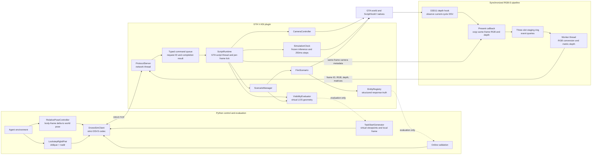

# DroneSimInGTAV

DroneSimInGTAV is a small GTA V research runtime for controlling a scripted
camera, acquiring synchronized RGB-D observations, and running a minimal
controlled fire-response experiment. Stage 2A adds an explicit lockstep
simulation clock so model inference time does not consume GTA simulation time.
Stage 2B adds named oblique and nadir RGB-D captures from one frozen
simulation instant.

The research direction is hidden-event localization from event-induced dynamic
responses. See [docs/research_direction.md](docs/research_direction.md).

## Strict research task definition

This project studies hidden-event localization from event-induced dynamic
responses. It is not oracle ObjectNav: the agent is never given the event
coordinate, a goal bearing, GTA entity handles, scenario truth, visibility
truth, or a world-coordinate camera matrix.

An episode starts from a scripted-camera pose whose local coordinate frame is:

- origin at the initial camera center;
- positive X along the initial body-forward direction;
- positive Y along the initial body-right direction;
- positive Z along GTA world up.

The first observation is acquired at `t = 250 ms` after the controlled
responses start. At the start, every geometry sample on the fire-source
vehicle must be physically occluded from the camera center. The fixed
`8 m` radius, `25 m` high fire/smoke envelope may have partial line of sight,
but it must not be task-observable in either named view. Its clear-sample
fraction is retained as diagnostic truth. Initial conditions are reported
separately:

- `CUE_VISIBLE`: the source vehicle is physically occluded, the fire/smoke
  envelope is not task-observable, and at least one affiliated response actor
  is task-observable;
- `CUE_HIDDEN`: the source vehicle is physically occluded, the fire/smoke
  envelope is not task-observable, and all affiliated response actors are
  initially not task-observable.

Each observation contains synchronized metric RGB-D from one frozen simulation
instant:

- `oblique`: pitch `-45 degrees`;
- `nadir`: pitch `-90 degrees`.

The canonical research action is a continuous relative-pose increment with a
three-dimensional translation norm no greater than `2 m` and an absolute yaw
increment no greater than `15 degrees`. One action advances exactly `250 ms`
of GTA simulation time. The canonical horizon is 40 actions, or 10 seconds of
simulation time. These research limits are separate from the `1 m / 15 degree`
manual keyboard controls.

The agent must express its event estimate in the start-local coordinate frame.
An episode succeeds only when all of the following hold at the same terminal
step:

```text
the agent issues STOP
AND the fire-source vehicle is task-observable in the final RGB-D observation
AND the agent provides a finite start-local 3D event coordinate
AND its world-space 3D Euclidean error is at most 5 m
```

The fire must be active at the terminal step. Seeing only a distant smoke
column is not sufficient terminal confirmation. `task-observable` means that
the target has at least four unoccluded in-frustum geometry samples, a
projected bounding span of at least 24 pixels, and a projected clear-sample
box at least 12 pixels inside every image border in either named view.

The following terms are deliberately distinct:

- `InitialVisibility`: what is observable at the first frozen observation;
- `CueAccessible`: whether response evidence can be reached while it remains
  useful;
- `GoalViewReachable`: whether the action budget permits a viewpoint that
  directly observes the fire-source vehicle;
- `TaskSuccess`: the strict terminal condition above.

Initial visibility, cue accessibility, and goal-view reachability are necessary
diagnostics, not proofs that the task is solvable. Stage 2C implements
visibility truth and task-start generation only. Stage 2D evaluates
spatiotemporal cue accessibility and goal-view reachability. Full task
solvability is tested later with an observation-only belief policy and the
strict terminal condition; it is never inferred merely from two observations
of a moving actor.

The research sequence is:

```text
lockstep and synchronized RGB-D
  -> dual-view observation
  -> visibility truth and task starts
  -> spatiotemporal cue accessibility and goal-view reachability
  -> response-ecology statistics
  -> paired counterfactual interventions
  -> explicit belief baseline
  -> learned temporal models and structured Awareness
```

## Architecture



The network thread never calls GTA natives directly. It validates each request,
places a typed command in the queue, and waits for the GTA script thread to
return a correlated result. Scenario preparation and maintenance advance from
the per-frame runtime tick. RGB-D capture remains a separate render-thread
pipeline, so scenario logic cannot manufacture or cache observations.

`RelativePoseController` and Capture V3 form the agent-facing boundary.
Scenario snapshots contain privileged event and entity truth for experiment
control and evaluation; they must not be included in an agent observation.

## Repository layout

```text
DroneSim/                  GTA V ASI plugin
  camera.*                 camera lifecycle and absolute pose control
  command_queue.*          request-correlated GTA-thread commands
  rgbd_capture.*           synchronized Capture V3 implementation
  scenario_manager.*       single-scenario lifecycle coordinator
  simulation_clock.*       lockstep session and fixed 250 ms advances
  fire_scenario.*          asynchronous controlled fire experiment
  entity_registry.*        stable entity IDs and response truth
  visibility.*             virtual-viewpoint occlusion geometry
  script.*                 minimal GTA script runtime
  server.*                 DSV3 TCP protocol server
agent_control/
  dronesim_client.py       strict Python client and relative-pose wrapper
  task_starts.py           evaluation-only starts and local task boundary
  requirements.txt         online validation dependencies
validation/
  rgbd_geometry.py
  rgbd_sync_metrics.py
  validate_dual_view_rgbd.py
  validate_pose_control.py
  validate_rgbd_pointcloud.py
  validate_rgbd_stability.py
  validate_rgbd_yaw_sync.py
  validate_fire_scenario.py
  validate_visibility_starts.py
```

## Build and install

Requirements:

- GTA V Legacy with ScriptHookV
- Visual Studio 2026 with Desktop development with C++
- Windows SDK and the v145 toolset
- x64 Release configuration

Open `DroneSim.sln`, select `Release | x64`, and build. Copy the resulting
`DroneSim.asi` next to `GTA5.exe`. The repository does not automatically copy
or install the ASI.

The plugin listens on `127.0.0.5:23456` by default.

- F9 shows the current GTA world position and camera rotation in the
  bottom-left notification feed.
- F10 creates the scripted camera.
- F11 stops the scripted camera and restores the player after validation teleportation.
- W/S move forward/backward by 1 metre.
- A/D strafe left/right by 1 metre.
- Q/E turn left/right by 15 degrees.
- Z/C move up/down by 1 metre.

Manual translation uses the same collision check as the network pose API.
Each physical key press performs one step; holding a key does not repeatedly
move the camera. While the scripted camera is active, GTA gameplay controls
are suppressed so these keys do not also move or operate the player. Pause
menu controls remain available, and normal player input resumes after F11.

The same camera operations are available through the Python client.

## Python client

Install only the validation dependencies:

```powershell
python -m pip install -r agent_control\requirements.txt
```

Basic use:

```python
from agent_control.dronesim_client import (
    DroneSimClient,
    LockstepSession,
    RelativePoseController,
)

client = DroneSimClient()
client.create_camera()

pose = client.get_pose()
frame = client.capture()

# The plugin receives an absolute GTA world position and yaw. Pitch and roll
# remain unchanged.
actual = client.set_camera_pose(
    pose[0],
    pose[1],
    pose[2],
    pose[5] + 45.0,
    collision_check=False,
)

# Agent-facing wrapper: forward, right, vertical, yaw delta.
controller = RelativePoseController(client, collision_check=True)
controller.synchronize()
controller.step_relative(0.5, 0.0, 0.0, 10.0)

# A scene must be Reset while frozen before this context can exit.
with LockstepSession(client) as lockstep:
    lockstep.advance()  # exactly one 250 ms GTA simulation step
    views = lockstep.capture_rgbd_pair()
    oblique = views.oblique
    nadir = views.nadir
```

All non-capture commands acknowledge only after the GTA script thread has
executed them. The Python client contains no settling sleeps. A failed command
raises `DroneSimCommandError` with one of:

- `CAMERA_INACTIVE`
- `INVALID_POSE`
- `COLLISION_BLOCKED`
- `COMMAND_TIMEOUT`
- `POSE_APPLY_FAILED`
- `POSE_MISMATCH`
- `INVALID_REQUEST`
- `INTERNAL_ERROR`
- `LOCKSTEP_ALREADY_ACTIVE`
- `LOCKSTEP_NOT_ACTIVE`
- `LOCKSTEP_SESSION_MISMATCH`
- `LOCKSTEP_ADVANCE_TIMEOUT`
- `LOCKSTEP_INTERRUPTED`
- `LOCKSTEP_CLOCK_INVARIANT_FAILED`

Capture keeps the existing V3 response: request/frame IDs, RGB, metric depth,
FOV, clip planes, projection matrix, and world-to-view matrix.

`capture_rgbd_pair()` is a Python-side composition over unchanged Capture V3.
It requires the lockstep session to be frozen, captures named `oblique`
(`-45` degree pitch) and `nadir` (`-90` degree pitch) frames, then restores the
canonical `-45` degree pitch. Both frames have the same simulation step and
camera center but different render frame IDs. With zero camera roll, the top
of the nadir image is body-forward and its right edge is body-right.

One GTA instance must be controlled by one `DroneSimClient`. The client
serializes the complete paired operation against other threads using the same
client object; separate client processes are not supported concurrently.

## Lockstep simulation time

Lockstep is a separate research mode. Enter sets GTA gameplay time scale to
zero and explicitly freezes the controlled response actors, while leaving the
script thread, camera commands, rendering, network protocol, and Capture V3
operational. `advance_lockstep()` releases those actors, temporarily runs the
world until the next cumulative 250 ms target, then freezes both the clock and
actors again before replying. The boundary records each response actor's
kinematics before freezing and restores its linear velocity on release; the
matched realtime/lockstep validation below checks whether this is sufficient
to avoid artificial repeated starts.
Inference wall time and RGB-D transfer time therefore do not age response
actors.

The intended scenario order is:

```python
scenario_id = client.prepare_fire_scenario((x, y, z), seed=1)
client.wait_scenario_ready(scenario_id)
with LockstepSession(client) as lockstep:
    client.start_scenario(scenario_id)
    initial_time = lockstep.advance()  # t = 250 ms
    views = lockstep.capture_rgbd_pair()  # simulation remains frozen

    # Reset must happen before Exit so no scene resumes during cleanup.
    client.reset_scenario(scenario_id)
```

Only one lockstep session can exist. Session IDs are checked on every clock
operation. There is no heartbeat, automatic real-time fallback, or variable
step duration. During lockstep, manual camera movement is disabled. F11 is the
emergency recovery path: it resets the scenario, restores normal time, stops
the scripted camera, and restores the player.

## Controlled fire scenario

The experiment lifecycle is `PREPARING -> READY -> RUNNING`, followed by an
explicit Reset. Prepare snaps the requested anchor to a nearby road, resolves
a deterministic blueprint, loads models, clears the controlled area, and
places a damaged `blista`, `firetruk` actors, and civilian pedestrians. Start
records one GTA timer/frame origin, activates the fire, and issues each
response task exactly once.

The Python client exposes:

```python
scenario_id = client.prepare_fire_scenario(
    anchor_world_xyz=(x, y, z),
    seed=1,
    firetruck_count=1,
    pedestrian_count=32,
)
ready = client.wait_scenario_ready(scenario_id)
start = client.start_scenario(scenario_id)
snapshot = client.get_scenario_state(scenario_id)
client.reset_scenario(scenario_id)
```

The caller must first teleport the player to the event area so GTA has loaded
collision there. Scenario truth is intended for experiment control and
evaluation; it is not exposed by `RelativePoseController`.

The supplied master seed is deterministically expanded into independent
firetruck-placement, pedestrian-placement, and pedestrian-model random streams.
Prepare with `blueprint_id=0` creates a new immutable blueprint after clearing
the controlled area. Its ID is returned in `ScenarioSnapshot.blueprint_id` and
survives Reset in a single-slot cache. A later Prepare can pass that ID and
instantiate any prefix of its actor capacity:

```python
superset_id = client.prepare_fire_scenario(
    (x, y, z), seed=1, firetruck_count=1, pedestrian_count=32
)
superset = client.wait_scenario_ready(superset_id)
client.reset_scenario(superset_id)

no_truck_id = client.prepare_fire_scenario(
    (x, y, z),
    seed=1,
    firetruck_count=0,
    pedestrian_count=32,
    blueprint_id=superset.blueprint_id,
)
```

The second instance reuses the exact pedestrian positions, headings, and
models; it does not call GTA safe-coordinate queries again. A reuse request
must match the cached anchor and seed and cannot exceed its actor counts. The
seed controls scene construction, not GTA AI pathfinding or frame-by-frame
response trajectories.

## Online validation

Every validation consumes RGB-D in memory. No image, depth map, video, PLY,
PCD, or point cloud is written to disk.

```powershell
python validation\validate_camera_lifecycle.py
python validation\validate_pose_control.py
python validation\validate_rgbd_yaw_sync.py
python validation\validate_dual_view_rgbd.py --anchor X Y Z
python validation\validate_dual_view_rgbd.py --anchor X Y Z --pairs 1000
python validation\validate_dual_view_rgbd.py --anchor X Y Z --show-pointcloud
python validation\validate_rgbd_pointcloud.py --pixel-stride 4 --max-view-depth 200
python validation\validate_rgbd_stability.py --count 1000
python validation\validate_fire_scenario.py --anchor X Y Z
python validation\validate_fire_scenario.py --anchor X Y Z --cycles 50
python validation\validate_fire_scenario.py --anchor X Y Z --rgbd-captures 1000
python validation\validate_fire_scenario.py --anchor X Y Z --require-clean-area
python validation\validate_fire_scenario.py --anchor X Y Z --verify-seed-isolation
python validation\validate_lockstep_clock.py --anchor X Y Z
python validation\validate_visibility_starts.py --anchor X Y Z
python validation\validate_visibility_starts.py --anchor X Y Z --show-starts
python validation\validate_visibility_starts.py --anchor X Y Z --queries 1000
```

The lockstep validator also reuses one immutable scenario blueprint for a
continuous realtime run and a matched `250 ms` lockstep run. It compares
response-actor path length, directional progress, and median speed so that
repeated freezing cannot silently turn vehicle motion into a sequence of
artificial restarts.

Mission entities inside the controlled radius are never deleted. They are
preserved and reported separately in `snapshot.protected_entities`; the normal
validator prints a warning and continues. Formal clean-area collection should
use `--require-clean-area`. While a scenario is active, all ambient and
scenario-ped density multipliers are set to zero each frame. Existing ordinary
entities that cross into the 120-metre controlled area are removed by periodic
area maintenance; protected mission entities remain registered.

When the scripted camera is active, the fire-scenario validator moves it once,
after Prepare reaches READY, directly above the resolved event position. This
avoids a second visible relocation while the scene is starting. The default
observer view is 40 metres above the event at a -70 degree pitch. Use
`--camera-height` and `--camera-pitch` to adjust the overview;
`--camera-pitch -90` looks straight down. Pitch control is a validation utility
and does not change the agent-facing relative-pose action.

To validate collision rejection, choose a world coordinate beyond a nearby
wall or inside solid geometry. A simpler option is to place the camera in front
of a wall, face the wall, and test a point ten metres forward:

```powershell
python validation\validate_pose_control.py --expect-forward-collision 10
```

The explicit world-coordinate form remains available as
`--expect-collision X Y Z`.

The lifecycle test stops and recreates the camera, verifies the inactive error,
and captures immediately without sleeps. `validate_pose_control.py` alternates
two absolute positions and yaws, then checks that the returned pose and Capture
V3 view matrix agree. The yaw synchronization test distinguishes RGB and depth
from two views. The point-cloud test merges eight directions into an
interactive in-memory cloud. The stability test checks 1,000 captures,
monotonic frame IDs, finite metric depth, latency, and GTA process memory.

## Protocol boundary

The transport remains DSV3. Retained commands are:

- create/stop/query camera
- get pose and set absolute position plus yaw
- set FOV, time, and weather
- teleport/protect and restore the player
- synchronized RGB-D capture
- prepare/query/start/reset a controlled fire scenario
- enter/query/advance/exit the lockstep clock
- query evaluation-only visibility from a virtual camera center
- resolve a loaded, collision-clear task-start altitude
- ping

Capture V3 is unchanged. Visibility and start probing use message IDs 31 and
32. Removed message IDs remain unsupported, with no compatibility fallback for
the old scene, recording, or discrete-action interfaces.
