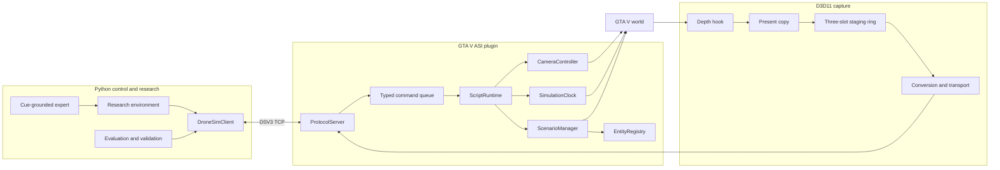

# Architecture

## System overview

## Thread and command boundary

The protocol server runs outside the GTA script thread. It validates binary
requests, assigns request IDs, submits typed commands, and waits for correlated
completion. GTA natives are called only by `ScriptRuntime` on the script
thread. A command succeeds only after the requested state change has executed
and the actual result has been read back.

The client does not use fixed settling sleeps. Timeouts and state violations
are explicit protocol errors. There is no compatibility fallback to removed
scene, oracle-navigation, recording, or discrete-action protocols.

## RGB-D capture

The depth hook only identifies the current-cycle depth-stencil view. At
Present, the capture path copies the matching backbuffer and depth resource
into one slot and assigns one frame ID. A preallocated three-slot staging ring
uses D3D11 event queries to avoid blocking GPU execution.

GPU Map and row-pitch copies occur at the render boundary. RGB conversion,
metric depth reconstruction, and transport occur on a worker thread. The
result contains RGB, metric depth, FOV, near/far planes, projection, and the
world-to-view matrix for that frame. Capture does not save or downsample data.

Only the validated backbuffer and depth formats are accepted. Missing,
ambiguous, stale, or changed resources fail the request instead of returning a
cached frame.

## Lockstep and dual view

`SimulationClock` has inactive, frozen, and advancing states. Enter freezes GTA
time and controlled response actors while leaving rendering, camera commands,
the script thread, and protocol operational. Advance releases actors until the
next cumulative `250 ms` target and freezes them again before replying.

The cumulative target prevents per-step overshoot from accumulating. Actor
kinematics are recorded at the freeze boundary and restored on release so
vehicles do not repeatedly restart from rest.

`LockstepSession.capture_rgbd_pair()` serializes the entire operation:

1. set pitch to `-45°` and capture oblique;
2. set pitch to `-90°` and capture nadir;
3. restore `-45°`;
4. verify session, step, timer, position, yaw, and roll did not change.

The two images are different render frames at one GTA simulation time.

## Agent and evaluation boundaries

`ResearchActionExecutor` exposes only the seven strict research actions and
start-local odometry. Raw absolute pose, view matrices, scenario snapshots,
visibility samples, and entity registry entries are privileged interfaces.

Evaluation truth may be used to build scenarios, validate starts, associate
anonymous targets, score cues, and compute terminal error. It must not be
inserted into an agent observation or learned-policy input.

## Protocol surface

The retained DSV3 surface covers:

- camera lifecycle, FOV, pose, time, and weather;
- player teleport/protection and restoration;
- synchronized RGB-D Capture V3;
- fire scenario Prepare, State, Start, and Reset;
- lockstep Enter, State, Advance, and Exit;
- evaluation-only visibility and geometry batch queries;
- ping and explicit error responses.

One GTA instance is controlled by one Python client. Multiple client processes
competing for the camera are unsupported.

## Emergency recovery

Normal shutdown resets the scenario while frozen, confirms EMPTY, exits
lockstep, restores GTA time, stops the camera, and restores the player. `F11`
is the in-game emergency path for client interruption or cleanup failure.
